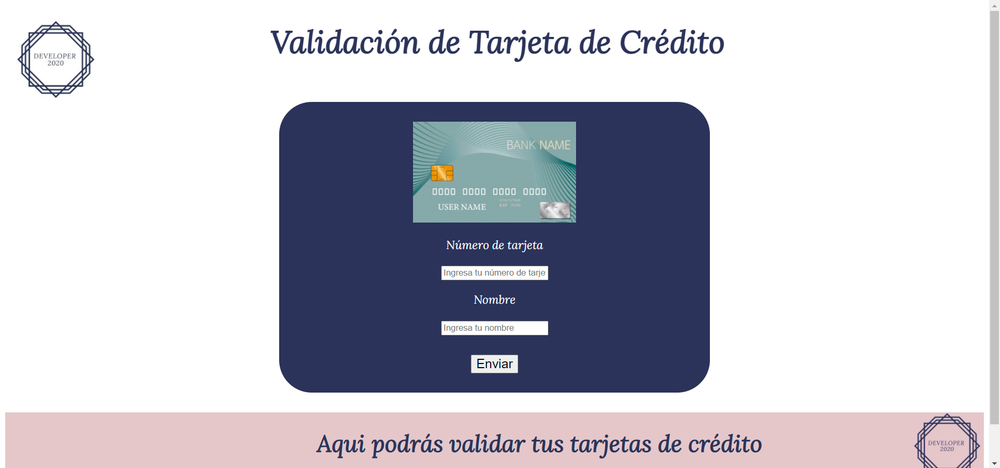
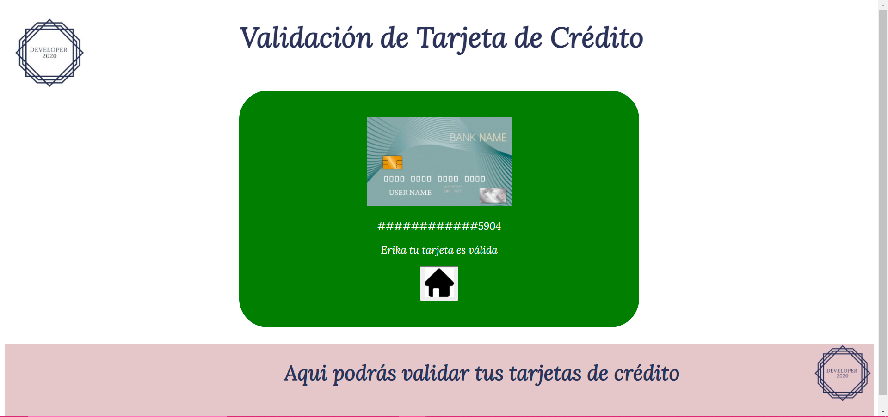
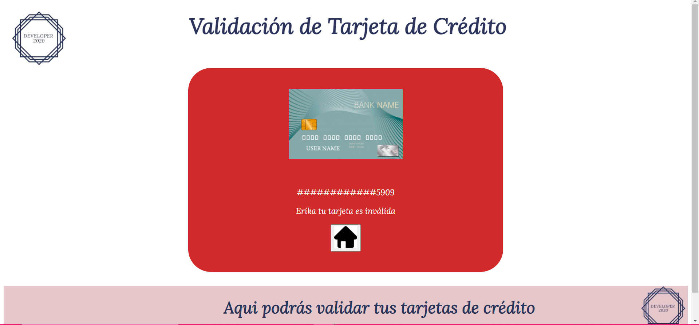
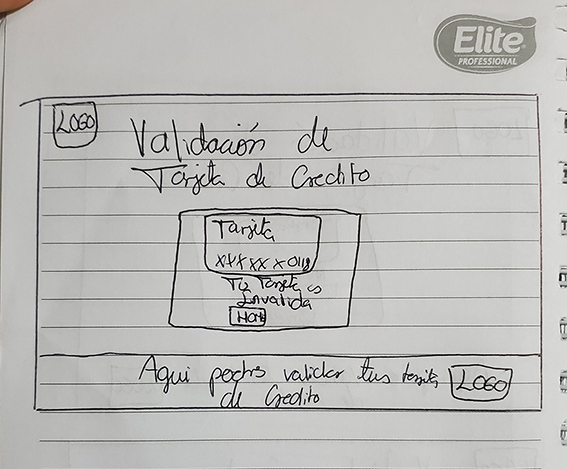
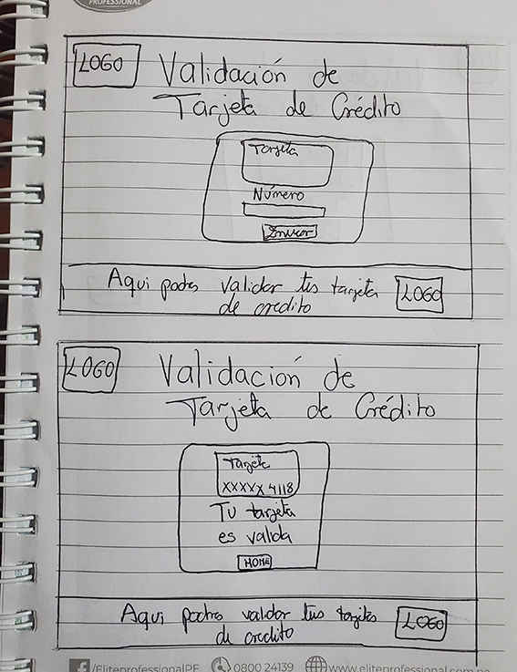
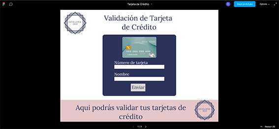
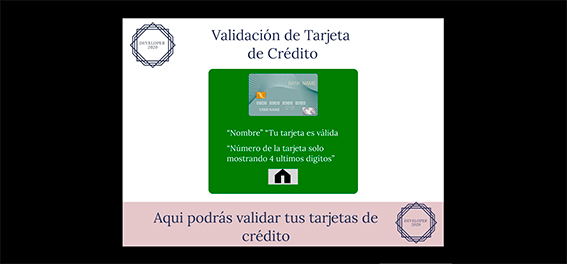
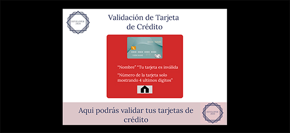

# Validación de tarjeta de crédito
El proyecto consiste en crear una aplicación web que permite al usuario validar su tarjeta de crédito y también ocultar todos los dígitos de su número de tarjeta menos los ultimos 4 caracteres.

## Proyecto Final

## Investigación UX
Los usuarios de este proyecto estan conformados por empresas que necesitan realizar una transacción online mediante una tarjeta de crédito, para ello necesitan un programa que pueda validar dichas tarjetas.

Con respecto al objetivo del producto se busca que el programa pueda realizar con exito las validaciones correspondientes, respetando los parametros establecidos:

* Insertar el número que queremos validar.
* Ver el resultado si es válido o no.
* Ocultar todos los dígitos de su número de tarjeta menos los últimos 4 caracteres.
* No debe poder ingresar un campo vacío.

Al utilizar dicho programa, las empresas pueden hacer una verificación óptima de las tarjetas de crédito que se vayan a utilizar para cualquier tipo de transacción

## Prototipo en hoja
 
 

## Feedback
Las recomendaciones recibidas para mejorar el prototipo fueron las siguientes:

* Letras mas grandes
* Botones mas grandes
* Si la tarjeta es válida, que su relleno cambiara a color verde
* Si la tarjeta es inválida, que su relleno cambiara a color rojo
* Hacer una justificación de colores, para que estuviera mas armónico el proyecto

Todas las recomendaciones fueron realizadas

## Prototipo Final
 
 
 
